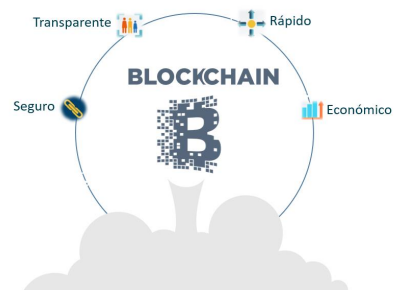

# Desarrollo

Se trata de un desarrollo tecnológico volcado a un código Blockchain, una base segura, compartida y distribuida que registra la propiedad de cualquier tipo de activo (no solo financieros). Esta base de datos solo permite añadir transacciones, por lo que es un registro inmutable y la misma base de datos es compartida porque se distribuye a todos los nodos; es descentralizada porque no existe un operador central. Y usa la criptografía para crear transacciones que son inmunes al fraude. Es altamente resistente a ataques externos, elimina reconciliaciones y disputas; simplifica mucho los procesos que implican varios participantes en localizaciones diferentes con diversos intereses (evita canales paralelos); permite crear nuevos negocios y servicios que hasta el momento no eran posible. En resumen, garantiza la integridad, trazabilidad completa, rápida implementación, escalable e interoperable, garantiza privacidad y es extremadamente seguro gracias a la criptografía, siendo así imposible de manipular.

El desarrollo de la plataforma para los tokens no fungible (NFT) está volcado a la Blockchain de código abierto de la Fundación Stellar, por tratarse de la más efectiva y eficaz en cuanto al desarrollo y transferencias de tokens de intercambio, de igual forma, ETTIOS está también programado en Binance Smart Chain (BSC), Ethereum y Polygon, a fin de contar con más pares de intercambio.

Stellar es una red punto a punto formada por nodos, que son computadoras que mantienen un libro mayor distribuido y común, que se comunican para validar y agregar transacciones. Los nodos utilizan un programa llamado Stellar Core, una implementación del Protocolo de Consenso Stellar , para mantenerse sincronizados mientras trabajan para acordar la validez de los conjuntos de transacciones y aplicarlos al libro mayor. En general, los nodos alcanzan el consenso y actualizan el libro mayor cada 3-5 segundos. Además, se requiere una confirmación de seis bloques lo que puede llevar a una hora.

Esto significa que un usuario de Bitcoin debe esperar aproximadamente 1 hora antes de poder estar seguro de que una transacción se considera definitiva. El Stellar Consensus Protocol (SCP) fue diseñado por David Mazières, profesor de Ciencias de la Computación en Stanford que también se desempeña como Científico Jefe en la Stellar Development Foundation. SCP utiliza un mecanismo novedoso llamado “Acuerdos Bizantinos Federados” para garantizar que las actualizaciones de un libro mayor distribuido sean precisas y confiables. SCP también se implementa en la práctica de una tecnología probada, dado que ha estado operando desde 2015. Al comparar los algoritmos de consenso existentes, el Protocolo de Stellar resulta ser la herramienta principal para el desarrollo de ETTIOS.

Es así que ETTIOS, bajo esta tecnología y otras similares (BSC, Ethereum y Polygon) puede ayudar a conectar económicamente a las personas de forma directa. Tal y como sucedió con la mensajería en internet tras la implementación del email. Por su desarrollo constante está destinada a ser una de las plataformas con mayor crecimiento en el mundo blockchain, contando además con una evolución continua de su tecnología, siendo así el soporte de valor del token nativo ETTIOS (ETT).