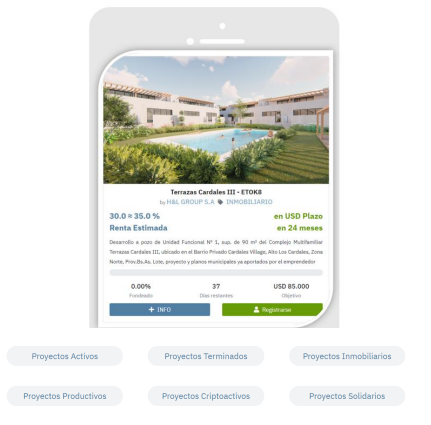

# Tokenización

La pregunta clave es ¿qué es un token? Y la respuesta tiene que ser simple y comprensible para todos. Un token es el resultado de la partición en segmentos iguales de un producto en particular. Llevándolo al punto en concreto, cada proyecto estará dividido en partes iguales, cada una de estas partes es un token. Por ejemplo, un proyecto que requiere un fondeo de U$S 200.000.-, será particionado en 2000 tokens que tendrán un valor de U$S 100.- cada uno. Los inversores si quieren acceder a realizar la inversión lo que están comprando son Tokens. El valor de este puede variar, ya que la inversión inicial y volviendo al ejemplo, sería de U$S 100.-, al momento de la liquidación, consecuencia de la realización del proyecto ese valor tendrá adosado la rentabilidad obtenida en cada caso.

Todos los proyectos que sean publicados en el sitio estarán tokenizados. Los Tokens, técnicamente, son conocidos como **NFT (llamado ETOK dentro de la plataforma de ETTIOS),** volcados a la blockchain.

El sitio (ETTIOS) distribuirá los pagos recibidos de cada proyecto financiado a todos lo que tengan el token del proyecto. Si por algún motivo, el inversor no quiere seguir conservando el token, tiene la posibilidad de transferirlo bajo cualquier forma jurídica a otra persona, según lo hayan convenido, y de esta manera transmitir a ella los derechos económicos del proyecto, operación que se realiza a través del trading de ETTIOS.

El inversor puede adquirir tokens de diferentes proyectos, y lo recaudado será destinado a la ejecución del o de los mismos. Este token y/o tokens dotan a su tenedor de los derechos económicos referidos, proporcionados por el emprendedor financiado. Dicho en otras palabras, descentraliza la propiedad de los proyectos.

